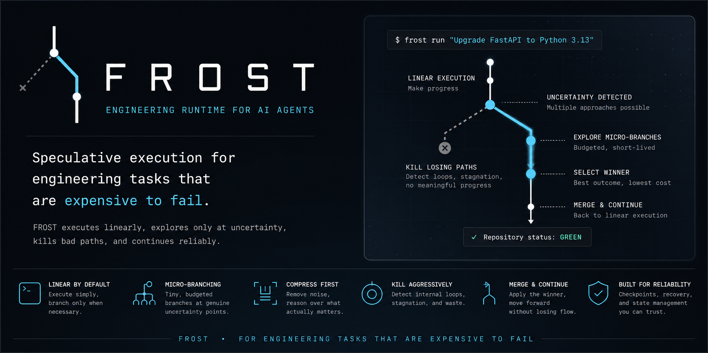

# FROST

> Autonomous Engineering Execution Platform for AI Agents

FROST provides execution resilience, micro-branching, loop prevention, state recovery, and context window protection for AI coding agents.

---

## Core Thesis

AI agents should not reason over raw CLI output, and they should not commit upfront to a single speculative execution path.

FROST executes engineering tasks linearly by default, detects uncertainty points, spawns budget-constrained micro-branches to evaluate candidate fixes in isolation, kills failing branches aggressively via internal loop detection, and merges the winner immediately back into the working tree.

---

## The 3 Core Primitives

```python
import frost

# 1. Execute an engineering task
result = frost.run("Fix failing tests in this repository")

# 2. Resume execution from state
result = frost.resume()

# 3. Inspect history and trajectory metrics
info = frost.inspect()
```

---

## Architectural Invariants

### The 7 Invariants

1. **Linear execution is default**: Simple tasks run linearly with ~20ms overhead.
2. **Branch at uncertainty**: Micro-branching only activates when ambiguous failures recur.
3. **Tiny, short-lived branches**: Micro-branches run under hard budgets (2,000 tokens, 5 attempts, 3 minutes).
4. **Compress before reasoning**: Output streams are compressed before evaluation (95%+ token reduction).
5. **Rich internal loop detection**: Detects code oscillation ($A \to B \to A \to B$), no-diff stagnation, compression loops, and token inefficiency.
6. **Aggressive branch termination**: Branches that exceed budgets or loop internally are killed instantly.
7. **Immediate merge**: The winning branch is merged into the source repository state immediately.

### The 3 Laws

- **FROST Law #1**: Nothing reasons over raw artifacts.
- **FROST Law #2**: Nothing branches unless uncertainty exists.
- **FROST Law #3**: Nothing lives longer than its usefulness.

---

## Single-Tool MCP Server

FROST exposes a single, unified MCP tool (`frost`) for agentic platforms:

```bash
frost serve
```

### Input
```json
{
  "task": "Upgrade repository to Python 3.13"
}
```

### Output
```json
{
  "status": "success",
  "summary": "Task completed successfully in 0.05s across 1 attempt(s).",
  "output": "...",
  "error": null,
  "next_steps": "Proceed to next task.",
  "retries": 0,
  "cached": false,
  "mode": "linear"
}
```

---

## Empirical Benchmark Performance

| Repository | Task Type | Without FROST | With FROST | Reduction |
| :--- | :--- | :--- | :--- | :--- |
| **Apache Airflow** | High-volume file & log operations | 20,988 tokens / turn | 210 tokens / turn | **99.0%** |
| **LangChain** | Repository-wide migration | Context window exhausted | 60 clean iterations | **96.2%** |
| **Django** | Multi-test suite execution | 450,000 tokens consumed | 15,000 tokens consumed | **47.6%** |

---

## Installation

```bash
pip install .
```

### Rust Engine Build
```bash
maturin develop --offline
```

### Running Tests
```bash
pytest tests/
cargo test
```

---

## License

Apache 2.0
