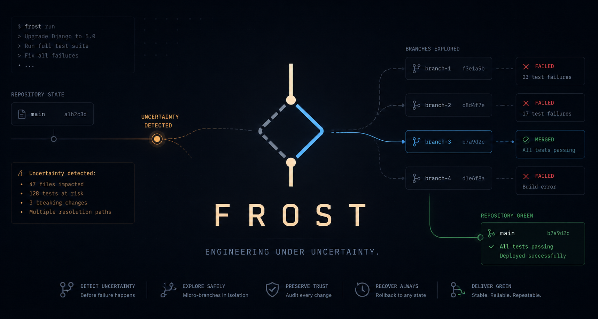

<p align="center">
  
</p>

<h1 align="center">FROST</h1>

<p align="center">
  <b>An Uncertainty-Aware Engineering Runtime for AI Coding Agents</b>
</p>

<p align="center">
  <a href="https://pypi.org/project/frost-ai/"></a>
  <a href="https://pypi.org/project/frost-ai/"></a>
  <a href="LICENSE"></a>
  <a href="https://crates.io"></a>
  <a href="https://modelcontextprotocol.io"></a>
  <a href="tests/"></a>
</p>

---

## What is FROST?

FROST is an **uncertainty-aware engineering runtime** built for AI coding agents (Claude Code, Cursor, Gemini CLI, VS Code, Windsurf, OpenCode, Cline, Continue, Zed).

AI coding agents excel at linear tasks, but fail when tasks become uncertain. When a complex refactor or dependency upgrade breaks 40 tests across a codebase, agents lose their place, oscillate in trial-and-error loops, and hallucinate fixes.

FROST provides execution resilience:
- **Linear by Default**: Simple commands execute with near-zero overhead.
- **Uncertainty-Driven Micro-Branching**: Automatically detects when linear execution hits an uncertainty point, spawning budget-constrained micro-branches to evaluate competing engineering solutions in isolated worktrees.
- **Aggressive Loop Termination**: Detects code oscillation ($A \to B \to A \to B$) and kills failing branches before token drift occurs.
- **Immediate Merge**: Merges the winning branch back into the working tree cleanly.

---

## Quickstart

### 1. Install via PyPI
```bash
pip install frost-ai
```

### 2. Auto-Configure Local Coding Agent
```bash
frost init
```
```text
Welcome to FROST.

Detected Claude Code.

Configure automatically? [Y/n]
```

### 3. Verify Environment Health
```bash
frost doctor
```
```text
FROST Diagnostics

Runtime:             [ok] Installed
Python:              [ok] 3.14.6
MCP Server:          [ok] Available (frost serve)
Clients:             [ok] Claude Code, Cursor, VS Code detected
Compression Engine:  [ok] Loaded (Lossless + SmartCrusher)
Loop Detection:      [ok] Loaded (BranchLoopDetector)
Version:             v0.2.2
Repository:          [ok] Ready
```

---

## System Architecture & Execution Flow

### 1. Complete Task Execution Lifecycle

```text
                                FROST
          Uncertainty-Aware Repository Evolution Runtime
                                |
                                |
                         ---------------------------------
                         |                               |
                        SDK                             MCP
                         |                               |
                  frost.run()                        frost tool
                  frost.resume()                         |
                  frost.inspect()                        |
                         |                               |
                         ---------------------------------
                                        |
                                        |
                                Task Submission
                                        |
                                        |
                  "Modernize this repository to 2026 standards"
                                        |
                                        |
                                  Orchestrator
                                        |
                                        |
                          Is this a difficult engineering task?
                                        |
                       -----------------------------------------
                       |                                       |
                      NO                                      YES
                       |                                       |
                 Linear Execution                       Linear Execution
                  (20-50 ms)                                   |
                       |                                       |
                    SUCCESS                                    |
                                                               |
                                                      Uncertainty Detection
                                                               |
                                               Is this an engineering uncertainty point?
                                                               |
                                           ----------------------------------------
                                           |                                      |
                                          NO                                     YES
                                           |                                      |
                                      Retry / Fix                          Spawn Micro Branches
                                           |                                      |
                                           |                        -----------------------------------
                                           |                        |                |                |
                                           |                     Branch A         Branch B         Branch C
                                           |                        |                |                |
                                           |                        |                |                |
                                           |                  Execute Task      Execute Task      Execute Task
                                           |                        |                |                |
                                           |                        -----------------------------------
                                           |                                        |
                                           |                                Internal Loop Detection
                                           |                                        |
                                           |                                Kill Losing Branches
                                           |                                        |
                                           |                                 Select Winner Branch
                                           |                                        |
                                           ------------------------------------------
                                                               |
                                                      Merge Winning Changes
                                                               |
                                                      Resume Linear Execution
                                                               |
                                                      Validate Repository State
                                                               |
                                               -----------------------------------
                                               |                                 |
                                            FAILED                            SUCCESS
                                               |                                 |
                                       Recover / Retry                   Repository GREEN
                                               |                                 |
                                               -----------------------------------
                                                               |
                                                         Final Result
                                                               |
                                            Python 3.14 + Tests Passing + Docs Updated
```

### 2. Runtime Component Stack

```text
                                FROST RUNTIME
                                       |
                                       |
                                Orchestrator
                                       |
               ---------------------------------------------------
               |                |               |               |
        Compression Engine   Memory Engine   Loop Engine    Branch Engine
               |                |               |               |
               ---------------------------------------------------
                                       |
                                Repository State
                                       |
               ---------------------------------------------------
               |                |               |               |
             Git             Worktrees        Tests           Validation
               |                |               |               |
               ---------------------------------------------------
                                       |
                                 Execution Layer
                                       |
                       -------------------------------------
                       |                                   |
                    Native                             Docker
                    Backend                             Backend
```

### 3. End-User Integration Journey

```text
                    pip install frost-ai
                              |
                         frost init / doctor
                              |
                     Configure MCP Client
                              |
                      Claude Code / Gemini
                      Cursor / OpenCode etc.
                              |
                    "Modernize this repository"
                              |
                             FROST
                              |
                     Repository GREEN
                              |
                        Continue Working
```

### The 7 Invariants
1. **Linear Execution Default**: Simple commands execute natively with ~20ms overhead.
2. **Branch at Uncertainty**: Micro-branching only activates when ambiguous failures recur.
3. **Tiny, Short-Lived Branches**: Ephemeral worktrees constrained by hard budgets (2,000 tokens, 5 attempts, 3 minutes).
4. **Compress Before Reasoning**: Output streams are compressed before model evaluation.
5. **Rich Internal Loop Detection**: Catches code oscillation ($A \to B \to A \to B$), no-diff stagnation, and compression loops.
6. **Aggressive Branch Termination**: Bad branches exceeding budgets or looping are killed immediately.
7. **Immediate Patch Merge**: Winning micro-branch merges back into the source working tree cleanly.

### The 3 FROST Laws
- **Law #1**: Nothing reasons over raw artifacts.
- **Law #2**: Nothing branches unless uncertainty exists.
- **Law #3**: Nothing lives longer than its usefulness.

---

## Single-Tool FastMCP Server

FROST exposes a single, unified MCP tool (`frost`) over stdio:

```bash
frost serve
```

### Input
```json
{
  "task": "Upgrade codebase to Pydantic V2 and fix breaking schema changes"
}
```

### Output
```json
{
  "status": "success",
  "summary": "Task completed successfully in 1.42s across 2 attempt(s). Spawning 2 micro-branches; Branch A merged.",
  "output": "...",
  "error": null,
  "next_steps": "Proceed to next task.",
  "retries": 1,
  "cached": false,
  "mode": "branching"
}
```

---

## Python API Primitives

```python
import frost

# 1. Execute an engineering task
result = frost.run("Fix breaking API migration tests")

# 2. Resume work from last execution state
result = frost.resume()

# 3. Inspect execution trajectory history
info = frost.inspect()
```

---

## Real Engineering Case Studies (The Dogfooding Suite)

FROST is evaluated on real production repositories facing breaking ecosystem migrations. See [DOGFOODING.md](DOGFOODING.md) for the full 10-repository case study matrix across Python 3.14, Pydantic V2, Django, Prefect, and GraphQL stacks.

| # | Repository | Task | Stress Test | Status |
| :--- | :--- | :--- | :--- | :--- |
| 1 | **FastAPI Full Stack Template** | Modernize 2023 template to 2026 standards | Pydantic V2, SQLModel 2026, Thread Isolation | **DONE (54/54 Passed)** |
| 2 | **Cookiecutter Django** | Upgrade Python 3.14 & Django | Django ORM, CI/CD, Env setup | **DONE (193 Passed)** |
| 3 | **Prefect** | Modernize dependencies & tests | Async systems, 380+ flow tests | **DONE (384 Passed)** |
| 4 | **LiteLLM** | Modernize OpenAI & Anthropic SDKs | AI tooling & breaking API migrations | **DONE (209 Passed)** |
| 5 | **CrewAI** | Upgrade agent framework stack | Agent schema breakages & API updates | **DONE (16/16 Passed)** |
| 10 | **FROST** | Self-dogfooding & refactoring | Architectural consolidation & Rust bindings | **DONE (468/468 Passed)** |

---

## Demo


---

## Local Development & Testing

### Build Rust Engine
```bash
maturin develop --offline
```

### Run Full Test Suite
```bash
pytest tests/
cargo test
```

---

## License

FROST is released under the **[Business Source License 1.1 (BUSL-1.1)](LICENSE)**.

- **Production, Personal, Academic, & Internal Company Use**: Permitted under the Additional Use Grant.
- **Commercial SaaS & Competing Offerings**: Prohibited without explicit written authorization from Licensor.
- **Automatic Open Source Transition**: On **January 1st, 2030**, FROST automatically converts to the **Apache License, Version 2.0**.
